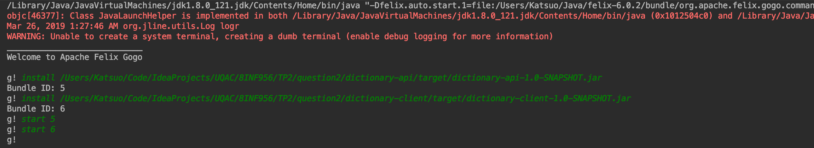

# 8INF956 - TP 2

## Question 1

Pour réaliser la nouvelle exigence demandée par le directeur, c'est-à-dire que la même application soit accessible via l’Internet, et éviter de modifier le code existant, nous avons décidé d'implémenter l'architecture MVC et le remoting proposés par le **Spring framework**.

L'architecture MVC va nous permettre de réutiliser le code existant sans le modifier. Elle est mise en place avec **Spring MVC**. 
Le modèle implémente l'interface Compte utilisée par l'application locale et l'application RMI.
La vue, créée en html avec *Thymeleaf*, permet l'affichage des données sur le navigateur web.
Le contrôleur fait le lien entre la vue et le modèle grâce au *RequestMapping* pour répondre aux requêtes HTTP de la vue et modifier le modèle. Le contrôleur accède au modèle grâce à *HTTP Invoker* du **Spring Remoting** qui permet d'invoquer des services à distance. 

Nous avons configuré le remoting avec des fichiers XML.
Le serveur web permet d'implémenter l'interface Compte et d'exposer le service via HTTP grâce à la configuration faite dans le fichier *ServeurWeb.xml*. 
L'application client invoque le service via l'adresse URL définie dans le fichier *guichet.xml*. 


## Question 2

Étant donné que nous proposons une interface graphique pour le bundle qui implémente les services de dictionnaire, nous procédons à l'injection des composants logicielles selon besoins par le programme.

Lorsque le bundle client est lancé, un premier service de dictionnaire français est installé et lancé. Par la suite, si l'utilisateur veut utiliser le service de dictionnaire anglais, il peut l'activer via un menu de selection. Le service de dictionnaire français se trouve ainsi désactivé.

Nous utilisons le ServiceTracker d'Apache Felix pour surveiller dynamiquement la disponibilité des services de dictionnaire. Ainsi l'application cliente utilise le premier service trouvé par le ServiceTracker.

### Guide d'utilisation

Pour lancer l'application, il faut d'abord compiler les modules Maven via le terminal en se plaçant dans le dossier question2 :

```
$ cd question2
$ mvn clean install
```

Ensuite, il faut lancer Apache Felix et installer les modules **dictionary-api** et **dictionary-client** via l'interface de ligne de commande Apache Felix Gogo avec la commande install suivi du chemin du fichier jar du module.
Démarrer en premier le bundle **dictionary-api** puis le bundle **dictionary-client** :

```
!g install /path-to/dictionary-api-1.0-SNAPSHOT.jar
Bundle ID: 5
!g install /path-to/dictionary-client-1.0-SNAPSHOT.jar
Bundle ID: 6
g! start 5
g! start 6
```



L'application se lance avec le service de dictionnaire français activé. Pour activer le service de dictionnaire anglais, il faut cliquer sur *Services de dictionnaire > Anglais*.


### Question 3

Nous avons décidé pour cette question d'appliquer le framework SpringMVC sur un exemple simple d'une application. Il s'agit d'une application web génératrice de blagues. 
Trois fonctionnalités sont disponibles : 
- Génération d'une blague aléatoire
- Consultation de toutes les blagues disponibles dans la base de données (MySQL)
- Création d'une nouvelle blague